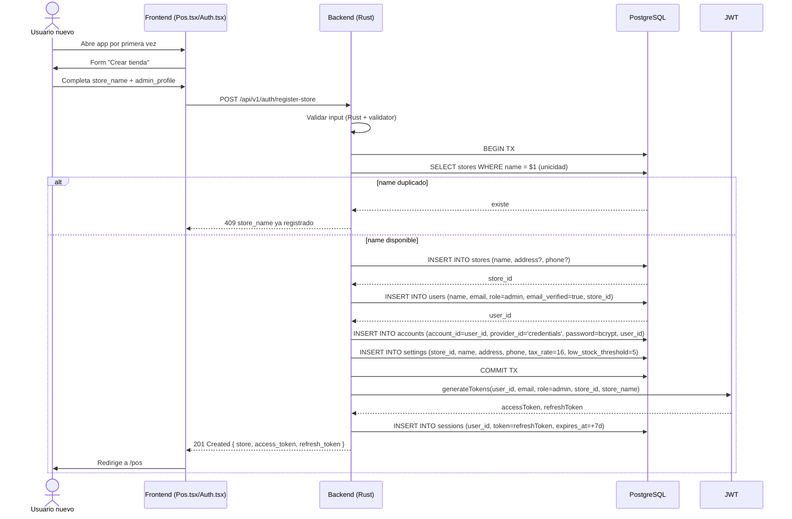

# 1. Registro de tienda (onboarding)

**Descripción**: Primer usuario llega al POS. Crea su tienda + admin user + settings default + primera sesión en una transacción atómica.

**Actores**: Usuario nuevo (no autenticado), Sistema

**Tablas involucradas**: `stores`, `users`, `accounts`, `settings`, `sessions`

**Endpoint**: `POST /api/v1/auth/register-store`

## Diagrama

## Side effects

1. `SET cookies: accessToken=…; refreshToken=…` (Fastify). Rust actual los devuelve en body — **decidir estandard**.

## Path Fastify ↔ Rust

| Fastify | Rust |
|---|---|
| `await prisma.$transaction(async tx => {...})` | `let mut tx = state.db.begin().await?; ... tx.commit().await?;` |
| `bcrypt.hash(password, 10)` | `hash_password(password)?` |
| `jwt.sign({ userId, email, role, storeId, storeName }, secret)` | `jwt::generate_tokens(...)` |
| `prisma.session.create({ token: refreshToken, ... })` | `SqlxSessionRepository.create(...)` |

## ⚠️ Acoplar a Fastify exactamente

- `email_verified = true` en admin onboarding (Fastify). Confirmar durante port.
- Token **en el body** (no cookie) en éxito de register-store. Fastify hace igual para register-store y register; solo login + refresh van por cookie.

## Errors a manejar

- `400` validación (e.g. password < 8).
- `409` store name duplicado o admin email duplicado.
- `500` error interno del DB.

## Tests sugeridos

- Onboarding completo → mockear DB → verificar 5 rows creadas + 2 tokens + 1 session.
- Concurrencia: dos requests simultáneos con el mismo store name → uno falla con 409.
- Reintento con token expirado después de registrar → no se regenera session.
