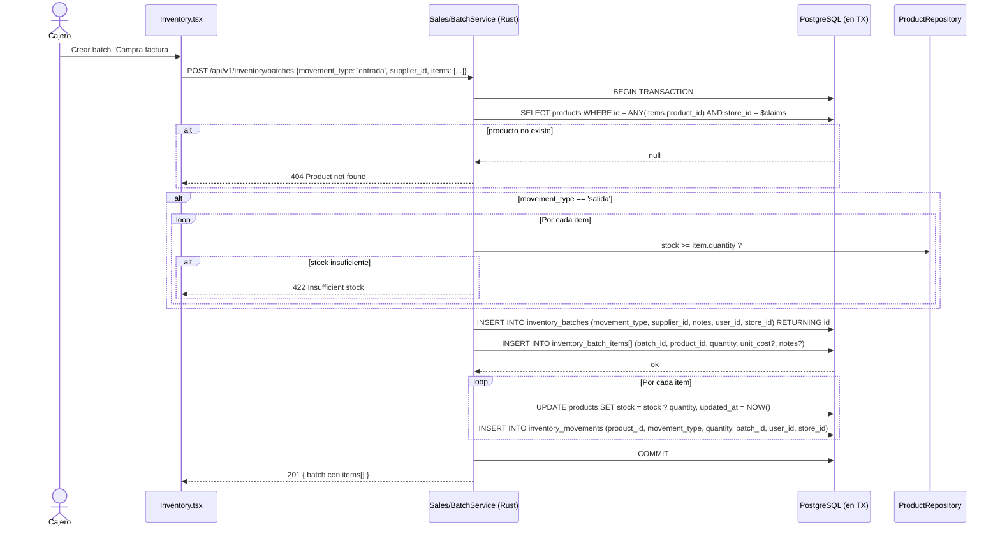
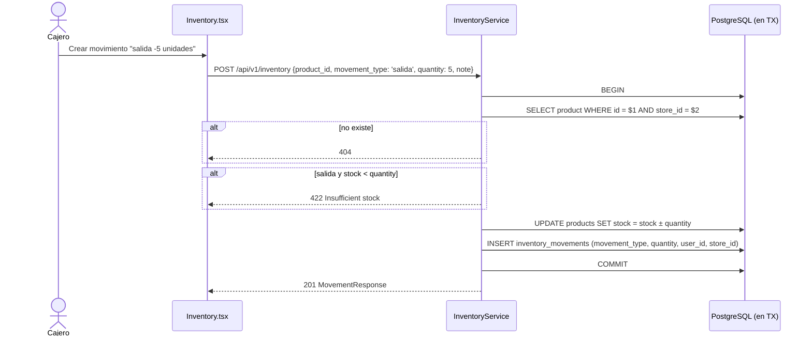

# 3. Movimientos de stock (batch e individual)

**Descripción**: Cualquier operación que modifique `products.stock` debe insertar un `inventory_movements` para trazabilidad y descontar/acrecentar el campo `stock` en la misma transacción.

**Actores**: Cajero autenticado, Sistema

**Tablas**: `inventory_batches`, `inventory_batch_items`, `inventory_movements`, `products`, `users`, `stores`, opcionalmente `suppliers`

**Endpoints**:

- `POST /api/v1/inventory` — movimiento individual.
- `POST /api/v1/inventory/batches` — batch masivo (1 a N productos en tx).

## Diagrama: Batch



## Diagrama: Individual



## Signo del delta

| `movement_type` | Efecto en `stock` | `quantity` sign |
|---|---|---|
| `entrada` | `+quantity` | positivo |
| `salida` | `-quantity` | positivo (la resta la aplica el server) |
| `ajuste` | `+quantity` (delta) ⚠️ Fastify | positivo |

> ⚠️ **NOTA**: Fastify trata `ajuste` como **delta positivo**, no como SET absoluto. Para que `ajuste` signifique "el stock ahora es X", habría que cambiar la semántica: pasar `quantity=X-stock_actual` o agregar un flag explícito. **Decision pendiente**.

## Mutaciones garantizadas atómicas

```sql
-- Individual
BEGIN;
  SELECT * FROM products WHERE id = $1 AND store_id = $2 FOR UPDATE; -- bloquear fila
  UPDATE products SET stock = stock + $3 WHERE id = $1;
  INSERT INTO inventory_movements (product_id, movement_type, quantity, user_id, store_id) VALUES (...);
COMMIT;
```

> `FOR UPDATE` en PostgreSQL bloquea el row para evitar race conditions cuando dos requests intentan actualizar el stock del mismo producto simultáneamente. **Implementar en el port**.

## Multi-tenancy

Cada query: `WHERE store_id = $claims.store_id`.

## Edge cases

| Caso | Comportamiento |
|---|---|
| Stock queda en 0 con `salida` | Permitido (stock = 0 es válido). |
| Stock queda negativo | Rechazado (422 Insufficient stock). |
| `quantity = 0` | Fastify lo rechaza en validación (`positive()` Zod). |
| Producto inactivo (`active=false`) | El movement puede existir pero la UI ya no lo lista. Decisión: ¿bloquear movimiento si inactivo? |
| Producto soft-deleted | 404. |

## Tests sugeridos

1. `POST /inventory` entrada — stock+=5, 1 movement creado.
2. `POST /inventory` salida — stock-=3, 1 movement creado; si stock<3 → 422.
3. `POST /inventory/batches` con 3 productos — 1 batch + 3 items + 3 movements + 3 updates de stock, todo en tx.
4. **Atomicidad**: simular error en el INSERT de inventory_movements → hacer rollback → verificar products.stock **NO se modificó**.
5. Concurrencia: dos `POST /inventory` simultáneos sobre el mismo product con stock=5 y quantity=5 → uno OK, otro 422. (Verifica FOR UPDATE o MVCC).
